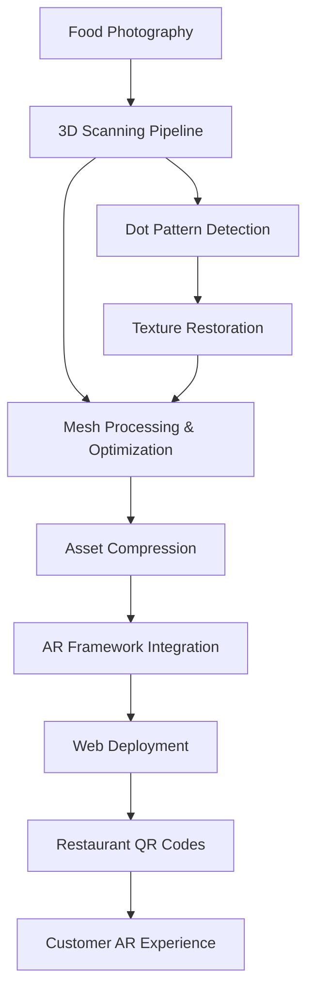

# From Concept to Market: The AR Dining Journey

AR Dining represents my first entrepreneurial venture into commercial augmented reality applications, marking the transition from experimental web AR projects to real-world business solutions. Founded under **Silkun Innovations** in partnership with a software engineer from BlackRock whom I met on Reddit, this project aimed to revolutionize the restaurant industry using cutting-edge AR technology.

> **= [Explore AR Dining repositories on GitHub](https://github.com/ar-dining)**

<div class="row">
    <div class="col-sm mt-3 mt-md-0">
        
    </div>
</div>

## The Problem: Bridging Expectation and Reality

Through extensive market research and customer interviews, we identified a fundamental disconnect in the dining experience: **customers were consistently disappointed by food that didn't match their expectations**. Our observations revealed a common behavior pattern - diners frequently look around restaurants to see what others are eating before making their ordering decisions.

This insight led to a clear value proposition: **what if customers could see exactly what their food would look like before ordering?**

## The Solution: Tracker-Based AR Menus

Our solution leveraged marker-based augmented reality to overlay 3D models of actual dishes directly onto existing paper menus. By scanning QR codes or AR markers, customers could visualize realistic 3D representations of food items in real-time, creating an immersive preview experience that eliminated guesswork from the ordering process.

### Core Technology Stack

The AR Dining platform was built around a sophisticated four-stage workflow:

1. **3D Food Scanning** - Photogrammetry and advanced scanning techniques
2. **Asset Optimization** - Compression and performance optimization
3. **AR Frontend Development** - Interactive viewing experiences
4. **Hosting Infrastructure** - Scalable deployment solutions

## Technical Implementation Deep Dive

### Stage 1: 3D Food Scanning - Overcoming Photogrammetry Challenges

The foundation of our AR experience required high-quality 3D models of actual restaurant dishes. We systematically evaluated every major 3D scanning solution available:

#### **Scanning Technologies Tested:**
- **KIRI Engine** - Mobile photogrammetry solution
- **Polycam** - Professional-grade mobile scanning
- **Scaniverse** - Niantic's LiDAR-powered app
- **Computer-based photogrammetry** - Desktop processing solutions
- **LiDAR vs. traditional photogrammetry** - Comparative analysis

#### **The Ceramic Plate Challenge**

Our biggest technical hurdle emerged from an unexpected source: **restaurant dishware**. Traditional photogrammetry algorithms struggle with thin, plain ceramic plates commonly used in restaurants, resulting in incomplete mesh reconstruction with holes where the plate should be.

<div class="row">
    <div class="col-sm mt-3 mt-md-0">
        
    </div>
</div>

**Innovation: Dot-Pattern Algorithm**
```
Challenge: Photogrammetry fails on plain ceramic surfaces
Solution: Strategic dot placement + custom removal algorithm
Result: Complete mesh reconstruction with texture preservation challenges
```

We developed a novel approach:
1. **Dot Application**: Strategically placed tracking dots on plate surfaces
2. **Capture Process**: Standard photogrammetry workflow with enhanced surface detail
3. **Post-Processing**: Custom Python algorithm using **bpy** (Blender Python API) to automatically detect and remove dots from textures
4. **Texture Restoration**: Advanced inpainting techniques to restore natural surface appearance

This process provided invaluable experience with:
- **Blender** - 3D modeling and mesh processing
- **Python/bpy** - Custom Blender extensions and automation
- **Computer vision** - Dot detection and texture manipulation algorithms


<div class="row mt-3">
    <div class="col-sm mt-3 mt-md-0">
        
    </div>
    <div class="col-sm mt-3 mt-md-0">
        
    </div>
</div>

### Stage 2: Asset Optimization Pipeline

Raw 3D scans typically exceeded 50MB per model - far too large for real-time web AR applications. We developed a comprehensive optimization pipeline:

#### **Optimization Tool Evolution:**
1. **gltf.report** - Initial web-based optimization (limited results)
2. **gltf-transform CLI** - Command-line processing with better compression
3. **Rapid Pipeline** - Production solution achieving **3-4MB per model** average

The Rapid Pipeline emerged as our production standard, delivering:
- **90% file size reduction** without significant quality loss
- **Batch processing capabilities** for restaurant-scale deployments
- **Automated LOD generation** for performance scaling

### Stage 3: AR Rendering Technology Selection

We conducted extensive testing of available AR frameworks to find the optimal solution for restaurant environments:

#### **AR Framework Evaluation:**

**AR.js**
-  Open-source and lightweight
- L Limited tracking stability in varying lighting
- L Performance issues with larger models

**Encantar.js**
-  Promising tracking accuracy
- L Failed to load larger GLB files consistently
- L Frequent crashes and instability

**Mind.js**
-  Good performance on simple models
- L Limited documentation and community support

**Eight Wall by Niantic**
-  Professional-grade tracking (makers of Pok�mon GO)
- L Licensing costs prohibitive for startup
- L Complex integration requirements

**Zappar's Mattercraft** P **Winner**
-  **Excellent documentation** and developer resources
-  **London-based company** - local support and collaboration
-  **Intuitive GUI** for rapid menu development
-  **Superior tracking stability** in restaurant lighting conditions
-  **Robust performance** with optimized 3D models

```javascript
// Example Mattercraft integration
import { Scene, Camera, Renderer } from 'mattercraft';

const scene = new Scene();
const camera = new Camera();
const renderer = new Renderer();

// Load optimized food model
const foodModel = await scene.loadGLTF('assets/models/pasta_carbonara_optimized.glb');

// Configure AR tracking
const tracker = scene.createImageTracker('menu_marker.png');
tracker.onVisible = () => {
    foodModel.setVisible(true);
    foodModel.animateIn();
};
```

## Product Evolution: Beyond Pure AR

### The 3D Menu Alternative

Market testing revealed an important insight: while AR menus were technically impressive, there was significant demand for **non-AR 3D visualization**. Many customers found pure 3D menu experiences more accessible than full AR implementations.

**Our Flagship Product: Panoramic 3D Menus**
- **AI-generated environments** using **Meshy.ai** for realistic table settings
- **360-degree food visualization** without AR hardware requirements
- **Lower technical barriers** for restaurant adoption
- **Better performance** on older mobile devices

This became our primary market entry strategy: introduce accessible 3D menus first, then evolve customers toward full AR experiences as their comfort with 3D interfaces developed.

## Advanced Research and Development

### Gaussian Splats: Next-Generation Food Scanning

As Gaussian Splatting technology emerged, we investigated its potential for solving our ceramic plate scanning challenges:

**Advantages:**
- **Superior surface reconstruction** - Successfully captured thin ceramic bowls without dot patterns
- **Photorealistic rendering** quality exceeding traditional mesh-based models
- **Faster capture process** compared to traditional photogrammetry

**Limitations:**
- **Limited web rendering libraries** - Few production-ready JavaScript implementations
- **File size challenges** - Splat files often larger than optimized meshes
- **Detail blur** - Small food items exhibited artifacts and blur
- **Hardware requirements** - Demanding rendering specifications

**Conclusion:** Gaussian Splats showed promise for larger food items and restaurant environments but weren't ready for small-scale food visualization in 2023.

### Image-to-3D: The Holy Grail

Our final research direction explored AI-powered image-to-3D generation as the ultimate solution for rapid menu digitization:

**The Vision:** Upload 2-3 photos of a dish � Automatically generate 3D model
**The Reality:** Generated models suffered from poor texture quality, making food appear like "play dough" rather than appetizing dishes

While this technology has potential, current limitations prevented production deployment for restaurant applications where visual appeal is critical.

## Business Development and Market Validation

### Restaurant Partnerships

AR Dining successfully deployed solutions for several London and Manchester establishments:

- **Grand Somsa** - Premium dining experience enhancement
- **Paisabor** - Cultural cuisine visualization
- **Pasha** - Middle Eastern restaurant chain integration
- **My Peshawar** - Traditional Pakistani cuisine showcase

Each deployment provided valuable insights into restaurant operations, customer behavior, and technical requirements for production AR systems.

## Technical Architecture



## Lessons Learned and Project Conclusion

### Market Reality vs. Technical Innovation

While AR Dining represented significant technological advancement, market research revealed fundamental challenges:

**Restaurant Priority Issues:**
- **Supplier communication systems** - More pressing than menu innovation
- **Inventory management** - Critical operational efficiency needs
- **Staff scheduling and payroll** - Core business process challenges

**Customer Adoption Barriers:**
- **Device limitations** - Small mobile screens inadequate for detailed menu viewing
- **Digital menu resistance** - Customers preferred physical menus unless provided with tablets
- **Tablet costs** - Hardware investment prohibitive for smaller establishments

### Technical Achievements

Despite market challenges, AR Dining delivered significant technical innovations:

 **Advanced 3D Scanning Solutions** - Solved ceramic surface reconstruction challenges
 **Production-Ready Optimization Pipeline** - Achieved web-suitable file sizes while maintaining quality
 **Cross-Platform AR Framework** - Stable tracking across diverse restaurant environments
 **Scalable Hosting Architecture** - Supported multiple concurrent restaurant deployments

<div class="row">
    <div class="col-sm mt-3 mt-md-0">
        
    </div>
</div>

### Business Impact

AR Dining provided invaluable experience in:
- **Market validation** methodologies for emerging technologies
- **B2B sales processes** in the hospitality industry
- **Technical solution scaling** from prototype to production
- **Team management** in a startup environment
- **Partnership development** with international co-founders

## Project Impact and Legacy

While AR Dining ultimately concluded operations, the project established critical foundations for future AR ventures:

- **Technical Expertise**: Deep knowledge of web AR development, 3D asset optimization, and photogrammetry
- **Market Understanding**: Clear insights into restaurant industry challenges and customer behavior
- **Business Experience**: Practical startup management and partnership development skills
- **Network Development**: Established relationships in London's tech and hospitality sectors

The technologies and methodologies developed for AR Dining continue to influence current projects, demonstrating the lasting value of ambitious technical exploration even when market timing proves challenging.

---

**Project Repository**: [github.com/ar-dining](https://github.com/ar-dining)
**Webpage**: [See the page](https://ar-dining.github.io)
**Company**: Silkun Innovations
**Technologies**: Mattercraft, Blender, Python, WebGL, Photogrammetry