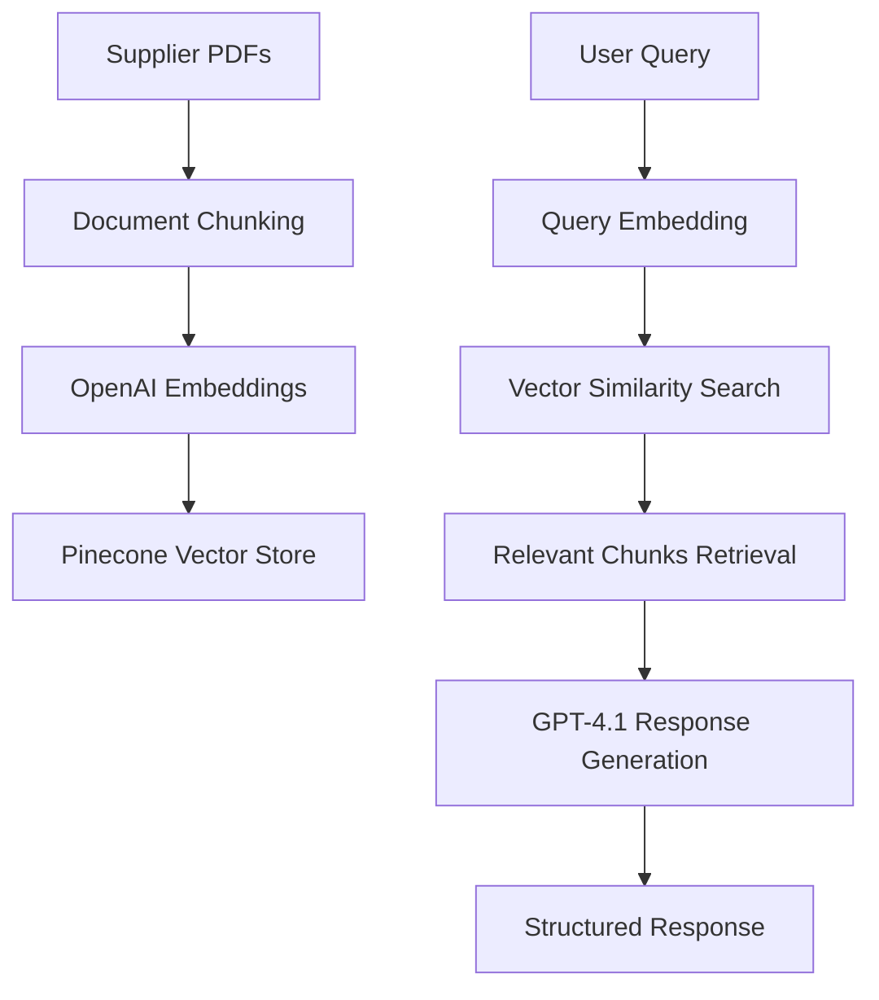

# From AR Innovation to Supply Chain Revolution

ProduDex emerged as the strategic pivot from AR Dining, representing a fundamental shift from consumer-facing AR experiences to solving critical operational challenges in the restaurant industry. After extensive market research and direct feedback from restaurant owners, we discovered that while AR menus were impressive, restaurants faced far more pressing operational issues that demanded immediate attention.

## The Hidden Crisis: Restaurant Supply Chain Complexity

Through our conversations with restaurant owners during the AR Dining phase, a consistent pain point emerged that completely reshaped our business focus. **The average restaurant owner manages relationships with at least 5-7 different suppliers**, each servicing different aspects of their operation:

- **Fresh Produce Suppliers** - Daily deliveries of fruits and vegetables
- **Meat and Seafood Distributors** - Protein-focused suppliers with cold chain logistics
- **Dry Goods Providers** - Pantry staples, spices, and non-perishables
- **Beverage Distributors** - Alcoholic and non-alcoholic beverages
- **Specialty Item Vendors** - Unique ingredients for signature dishes
- **Packaging and Disposables** - Take-out containers, napkins, cleaning supplies

This multi-supplier ecosystem created an operational nightmare:
- **Weekly coordination meetings** with multiple vendors
- **Inconsistent pricing** across similar products
- **Quality variations** between suppliers
- **Delivery scheduling conflicts** and logistics coordination
- **Payment management** across multiple accounts and credit terms

Restaurant owners expressed frustration at spending **20-30% of their administrative time** on supplier management rather than focusing on customer experience and food quality.

## The Vision: Alibaba for the Food Industry

Our solution crystallized around creating a unified platform that would revolutionize restaurant-supplier relationships. The core concept: **develop an intelligent chatbot interface that could serve as a single point of contact for all supplier needs**.

### Platform Objectives:
1. **Supplier Consolidation** - Reduce the number of suppliers restaurants need to manage
2. **Price Optimization** - Enable transparent pricing comparison across vendors
3. **Intelligent Matching** - Connect restaurants with suppliers based on location, needs, and preferences
4. **Streamlined Communication** - Single interface for all supplier interactions
5. **Automated Procurement** - Reduce manual ordering and reordering processes

## Technical Architecture: The n8n Discovery

Coming from an AI background with experience in FastAPI and Railway deployments, I initially planned to build traditional REST endpoints for every AI interaction. However, this approach proved **tedious and maintenance-heavy** for the complex automation workflows we envisioned.

The breakthrough came with discovering **n8n** - a powerful workflow automation platform that promised to revolutionize how we built AI-powered backend systems.

### The n8n Learning Journey

**Week 1: Fundamentals Mastery**
- Visual workflow design paradigms
- Node-based automation architecture
- API integration patterns
- Data transformation pipelines
- Conditional logic and branching

**Week 2: ProduDex Agent Development**
- RAG (Retrieval Augmented Generation) system design
- Vector database integration
- LLM orchestration workflows
- Error handling and retry mechanisms

The speed of development with n8n was **revolutionary** compared to traditional backend development - what would have taken weeks of FastAPI endpoint creation was accomplished in days of visual workflow design.

<div class="row">
    <div class="col-sm mt-3 mt-md-0">
        
    </div>
</div>

## Phase 1: RAG-Powered Supplier Intelligence

### Technical Implementation Stack

**Core Technologies:**
- **n8n** - Workflow automation and orchestration
- **GPT-4.1** - Natural language processing and generation
- **Pinecone** - Vector database for similarity search
- **OpenAI Embeddings (text-embedding-ada-002)** - Document vectorization
- **Supabase** - Structured data storage and management

### RAG System Architecture

The Retrieval Augmented Generation approach solved a critical challenge: **how to give our AI agent access to vast supplier catalogs without consuming excessive API tokens**.



**Phase 1 Results:**
- **8 supplier catalogs** successfully scraped and processed
- **~20,000 food items** vectorized and searchable
- **Sub-second query response times** for ingredient searches
- **Multi-supplier comparison** capabilities for overlapping products

### Initial Success and Challenges

The first iteration **actually worked** - restaurant owners could query for specific ingredients and receive comprehensive supplier options with pricing and availability information. However, we quickly encountered significant technical limitations:

**Challenge 1: Embedding Quality Bias**
Certain suppliers consistently appeared in results due to:
- **Document formatting differences** affecting embedding quality
- **Keyword density variations** in product descriptions
- **Inconsistent terminology** across supplier catalogs

**Challenge 2: Overlapping Product Confusion**
Multiple suppliers offering identical items created:
- **Redundant search results** with minimal differentiation
- **Price comparison difficulties** due to varying product specifications
- **Quality assessment challenges** without standardized product codes

## Evolution to Structured Data Architecture

### The Mistral OCR Breakthrough

The solution required a fundamental architectural shift from pure RAG to hybrid **structured database + RAG** approach. This transition was enabled by breakthrough developments in OCR technology, specifically **Mistral OCR**, which demonstrated superior performance in food industry document processing benchmarks.

**Extraction Process:**
1. **OCR Text Extraction** - Mistral OCR processes PDF catalogs
2. **AI Product Parsing** - GPT-4.1 identifies individual food items, prices, descriptions
3. **Data Validation** - Automated quality checks for completeness and accuracy
4. **Dual Storage** - Products stored in both Pinecone (semantic search) and Supabase (structured queries)

### Supabase: A Superior Alternative to Firebase

This project marked my first experience with **Supabase**, transitioning from Firebase used in AR Dining. The differences were immediately apparent:

**Supabase Advantages:**
- **PostgreSQL Foundation** - Full SQL capabilities vs Firebase's NoSQL limitations
- **Real-time Subscriptions** - Built-in live data updates
- **Row Level Security** - Granular access controls
- **Auto-generated APIs** - RESTful and GraphQL endpoints
- **Built-in Authentication** - Comprehensive user management
- **Superior Developer Experience** - Better documentation and tooling

The structured approach enabled:
- **Precise ingredient matching** across suppliers
- **Accurate price comparisons** for identical products
- **Quality scoring** based on supplier ratings and reviews
- **Geographic optimization** for delivery logistics

<div class="row">
    <div class="col-sm mt-3 mt-md-0">
        
    </div>
</div>

## Business Development Automation

### The Supplier Access Challenge

One of our most significant obstacles was **gaining access to supplier product catalogs**. The food supply industry operates on closed-loop relationships where:

- **Pricing information is confidential** until approved vendor status
- **Product catalogs require business verification** and credit checks
- **Application processes are lengthy** and relationship-based
- **Access is often granted through personal recommendations**

### n8n Automation Workflows for Lead Generation

To scale our supplier onboarding process, I developed sophisticated n8n workflows that automated multiple outreach strategies:

#### **Workflow 1: Email Outreach Automation**
```
Trigger: New supplier identified �
Research: Company details scraping �
Personalization: Custom email generation �
Outreach: Automated email sequences �
Follow-up: Smart response tracking
```

#### **Workflow 2: PDF Scraping and Acquisition**
```
Input: Supplier website �
Crawling: Public document discovery �
Analysis: PDF content evaluation �
Contact: Targeted requests for catalogs �
Monitoring: Response tracking and follow-up
```

#### **Workflow 3: Reddit-Based Networking**
```
Monitoring: Industry subreddit scanning �
Identification: Supplier representatives �
Research: Profile and company analysis �
Engagement: Personalized outreach messages �
Relationship: Meeting scheduling automation
```

These workflows are detailed extensively in my **[n8n Marketing Workflows project](https://hassan-xr.com/projects/n8nMarketingWorkflows_project/)**.

<div class="row">
    <div class="col-sm mt-3 mt-md-0">
        
    </div>
</div>

## Team Dynamics and Development Velocity

### Distributed Development Excellence

The ProduDex development process showcased the power of focused role specialization:

**Frontend Development** - BlackRock Software Engineer
- React-based chatbot interface
- Real-time supplier recommendation display
- Mobile-responsive design for restaurant environments
- Integration with backend APIs

**Backend Development & AI Systems** - Personal Focus
- n8n workflow orchestration
- RAG system architecture
- OCR processing pipelines
- Database design and optimization

This division of labor resulted in **unprecedented development velocity** - features that would typically require weeks of coordination were implemented in days. The clear separation of concerns allowed for parallel development and rapid iteration cycles.

## Market Validation and Strategic Insights

### Google Ads Campaign Analysis

To validate market demand, we launched targeted Google Ads campaigns focusing on restaurant supplier keywords. The campaign data revealed critical insights about our target market:

**Search Query Analysis:**
- **Restaurant owner searches**: 23% of traffic
- **Supplier company searches**: 45% of traffic
- **Food service distributor searches**: 32% of traffic

**Key Insight**: Our search data indicated that **suppliers were more actively seeking restaurant clients** than restaurants were seeking new suppliers. This suggested that our value proposition might be stronger as a **supplier-focused platform** rather than restaurant-focused.

### Product-Market Fit Challenges

Despite technical success, we encountered fundamental market challenges:

**Challenge 1: Niche Market Size**
- Restaurant procurement decision-makers represent a limited addressable market
- Geographic constraints limit supplier-restaurant matching opportunities
- Seasonal variations significantly impact search volumes

**Challenge 2: Entrenched Relationships**
- Restaurants prefer working with trusted, established suppliers
- Personal relationships often override price optimization considerations
- Risk aversion in food supply chain decision-making

**Challenge 3: Implementation Complexity**
- Restaurant staff training required for new procurement processes
- Integration with existing POS and inventory systems needed
- Change management challenges in traditional industry

## Lessons Learned and Future Vision

### Technical Achievements

ProduDex delivered significant innovations in AI-powered B2B platforms:

 **Advanced OCR Integration** - Successfully processed diverse supplier document formats
 **Hybrid RAG + Structured Data** - Balanced semantic search with precise querying
 **Automated Lead Generation** - Scaled supplier onboarding through n8n workflows
 **Real-time Chatbot Intelligence** - Created responsive supplier recommendation system

### Strategic Insights

**Market Timing Considerations:**
- The restaurant industry adoption of AI tools was earlier than optimal
- Supply chain digitization required more foundational infrastructure development
- B2B sales cycles in food service are longer than anticipated

**Platform Strategy Learnings:**
- **Supplier-side value proposition** may be stronger than restaurant-side
- **Geographic density** crucial for viable marketplace economics
- **Delivery logistics** more critical than price optimization for many restaurants

### Modern Approach: The WhatsApp Pivot

If approaching this problem today, I would implement a fundamentally different strategy:

**Technology Stack:**
- **Agentic Deep Search** - Multi-step reasoning for complex supplier queries
- **WhatsApp Business API** - Native mobile interface restaurants already use
- **Focus Shift**: From price optimization to **delivery tracking and reliability**

**Rationale:**
- Restaurant managers are mobile-first and prefer messaging interfaces
- WhatsApp eliminates app installation and training barriers
- Delivery reliability often more valuable than marginal price savings
- Agentic AI can handle complex, multi-step supplier research autonomously


## Project Impact and Technical Legacy

### Development Velocity Innovation

ProduDex proved that **n8n workflow automation** could dramatically accelerate AI backend development. The visual workflow approach reduced development time by an estimated **70%** compared to traditional API development.

### Database Architecture Insights

The transition from Firebase to **Supabase** established patterns that continue to influence current projects:
- PostgreSQL-first data modeling approaches
- Real-time subscription architectures
- Row-level security implementation strategies

### AI System Design Patterns

The hybrid **RAG + structured data** architecture developed for ProduDex became a template for subsequent AI applications requiring both semantic search and precise data retrieval.

## Conclusion: Strategic Pivoting and Market Adaptation

While ProduDex ultimately concluded operations, the project delivered invaluable insights into B2B AI platform development and market validation methodologies. The experience demonstrated that **technical excellence must align with market readiness** for successful commercialization.

The rapid development velocity achieved through n8n workflows and the innovative approaches to supplier data acquisition continue to influence current projects, proving that ambitious technical exploration creates lasting value even when market timing proves challenging.

**Key Takeaways:**
- **Platform strategy** requires careful consideration of which side of the marketplace to prioritize
- **Automation workflows** can dramatically scale business development processes
- **Market research** must extend beyond initial customer interviews to search behavior analysis
- **Technology adoption** in traditional industries requires patience and foundational education

The ProduDex journey reinforced that successful startups require not just innovative technology, but precise timing, market readiness, and sustainable business model validation.

---

**Technology Stack**: n8n, GPT-4.1, Pinecone, Supabase, Mistral OCR
**Timeline**: 2023-2024
**Team**: 2 developers (Frontend + Backend/AI)
**Industry**: Restaurant Technology, Supply Chain Automation